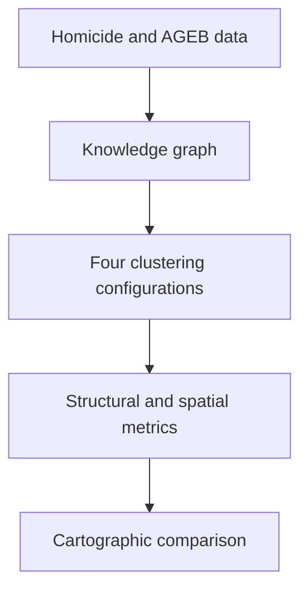

# Community Detection and Spatial Analysis of Firearm-Related Homicides in Mexico City

This repository contains the data-processing notebooks, knowledge-graph files, and spatial layers used to study firearm-related homicides recorded in Mexico City between **2017 and 2022** through graph community detection and spatial clustering.

The methodological framework compares four configurations:

1. **Louvain only** — community detection over the complete knowledge graph.
2. **DBSCAN only** — density-based clustering of the incident records.
3. **Louvain → DBSCAN** — graph communities are detected first and DBSCAN is subsequently applied within them.
4. **DBSCAN → Louvain** — spatial clusters are identified first and Louvain is subsequently applied to the corresponding graph substructures.

The detailed cartographic analysis focuses on **Iztapalapa**, while the underlying homicide and knowledge-graph data cover Mexico City.

## Workflow



## Repository contents

### Recommended analysis notebooks

| File | Description | Status |
|---|---|---|
| `Louvain and spatial aggregation.ipynb` | Documented Louvain-only analysis, community characterization, linkage to homicide records, and spatial aggregation. | Recommended Louvain notebook |
| `SoloDBSCAN .ipynb` | DBSCAN-only baseline using spatial, temporal, and demographic variables. | Exploratory baseline |
| `Louvain sub-arma-de-fuego-v6.ipynb` | Hybrid and iterative experiments combining Louvain with DBSCAN and spatial aggregation. | Latest experimental version |


### Data and graph files

| File or directory | Description |
|---|---|
| `homicidioscdmx.csv` | Firearm-homicide records with temporal, demographic, and geographic attributes. |
| `agebspob.csv` | AGEB-level population and socioeconomic attributes. |
| `grafoarmfuego4.json` | NetworkX node-link representation of the firearm-homicide knowledge graph. |
| `homicidiosKG4.ttl` | RDF/Turtle representation of the knowledge graph. |
| `Shapefiles/` | Geographic layers used for borough and AGEB-level cartography. |

A shapefile is composed of several associated files (`.shp`, `.shx`, `.dbf`, `.prj`, and sometimes `.cpg`, `.sbn`, or `.sbx`). Keep these components together when downloading or moving the spatial data.

## Louvain baseline stored in the notebook

The saved Louvain-only execution reports:

| Metric | Value |
|---|---:|
| Graph nodes | 12,938 |
| Graph edges | 46,557 |
| Louvain communities | 73 |
| Modularity | 0.400476 |

These values correspond to the serialized graph and saved execution currently included in the repository. Results may vary if the input graph, random seed, package versions, or preprocessing steps are changed.

## Methodological outline

### 1. Data preprocessing

The homicide records are filtered to the study period and transformed into variables representing location, year, age group, and sex. Geographic coordinates are converted to point geometries in `EPSG:4326`.

### 2. Knowledge-graph analysis

The serialized graph is loaded with NetworkX. Louvain modularity optimization assigns each graph node to a community. Community structure is characterized using node and edge counts, modularity, closeness, betweenness, and average shortest-path length.

### 3. Record linkage

Numeric incident URIs in the knowledge graph are matched to `idCarpeta` in the homicide table. This links graph communities back to the original incident-level geographic and demographic information.

### 4. Spatial analysis

Incident coordinates are overlaid on AGEB polygons and enriched with population and poverty attributes. DBSCAN and the sequential configurations are then used to evaluate the relationship between graph structure and spatial concentration.

For cartographic comparisons, communities should be selected reproducibly—for example, by choosing the communities with the largest numbers of unique georeferenced incidents—rather than by their position in an unsorted list of labels.

## Installation

Python 3.10 or 3.11 is recommended. Create a dedicated environment and install the main dependencies:

```bash
conda create -n homicide-kg python=3.11 -y
conda activate homicide-kg

pip install \
  jupyterlab pandas numpy scipy matplotlib seaborn plotly \
  scikit-learn networkx python-louvain igraph leidenalg \
  geopandas shapely geopy libpysal rdflib ontospy unidecode
```

Clone the repository and start JupyterLab:

```bash
git clone https://github.com/fcarrillo-brenes/Louvain-DBSCAN.git
cd Louvain-DBSCAN
jupyter lab
```

Open `Louvain and spatial aggregation.ipynb` to inspect the documented Louvain workflow.

## Reproducibility notes

- Louvain uses a fixed random state in the documented baseline.
- Network layouts use a separate fixed seed and do not affect the detected partition.
- Some legacy cells use manually selected community labels or root incidents. These cells are exploratory and should not be interpreted as automatic model output.
- The spatial layer is stored under `Shapefiles/`; file paths in older notebooks may need to be updated accordingly.
- Some exploratory cells refer to intermediate objects or external layers that are not part of the clean execution path.
- Run the final notebooks from a clean kernel and record the package versions before archiving the replication release.

## Data responsibility

The repository contains derived administrative and geographic data used for academic research. Although direct personal names are not included, incident identifiers and geographic coordinates may still be sensitive. Users should avoid attempts to re-identify individuals and should follow the terms established by the original data providers.

The homicide, census, poverty, and geographic data remain subject to the attribution and reuse conditions of their respective official sources. Their inclusion in this repository does not automatically relicense third-party data.
